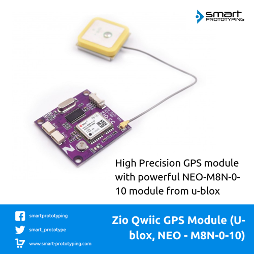

# Zio Qwiic GPS Module (U-blox NEO-M8N-0-10)

> This product can be available for purchase [here](https://www.smart-prototyping.com/Zio-Qwiic-GPS-Module-U-blox-NEO-M8N-0-10).

#### Description

GPS is the most interesting part for makers, with GPS, you can know where you are, or state the location of the object that you are tracking. 

This is a high precision GPS module that includes a powerful NEO-M8N-0-10 module from u-blox. 

The NEO-M8N module is based on the u-blox M8 GNSS (GPS, GLONASS, BeiDou, QZSS, SBAS and Galileo-ready1) engine that provides high sensitivity and minimal acquisition times while maintaining low system power.

We used a SC16IS752IPW to convert the module’s data from UART to I2C (Qwiic connectors),  so that you can use [Qwiic cable](https://www.smart-prototyping.com/zio-cables) to quickly connect the GPS module to any other Qwiic devices.
We also breakout the UART port to a 1.27mm terminal connector, just in case you want to use UART port directly.  

We’ve even included a rechargeable backup battery to help keep the latest module configuration and satellite data available for up to two weeks. This battery helps to ‘warm-start’ the module, decreasing the time-to-first-fix dramatically. It also features a survey-in mode allowing the module to become a base station and produce RTCM 3.x correction data (as opposed to the previous version of the module which is not able to produce RTCM data).

We also offer you a tested GPS antenna for the module, you can just plug it into the IPX connector on the board. The antenna is required when you get it running. Note: The antenna needs to face towards the top.

#### Specification

* Voltage: 3.3V
* Horizontal position accuracy: 2.5 m
* Heading accuracy: 0.3 degrees
* Velocity accuracy: 0.05 m/s
* Time-To-First-Fix: 27 - 30s (cold), 1s (hot)
* Interface: I2C and UART

* IC:SC16IS752
* address: 0x4D, 0x4C, 0x49, 0x48 (Default: 0x4D)
* Dimension: 35.5 x 35.8mm
* Weight: 7.8g

#### Links

* [PCB Source file](https://github.com/ZIOCC/Zio-Qwiic-GPS-Module-U-blox-NEO-M8N-0-10/tree/master/EAGLE)
* [PCB schematic](https://github.com/ZIOCC/Zio-Qwiic-GPS-Module-U-blox-NEO-M8N-0-10/blob/master/zio%20qwiic%20gps%20module%20ublox%20schematic%20pdf.pdf)
* [Demo code](https://github.com/toskyRocker/Arduino_Parser_Ublox_Neo_M8N)
* [GPS module NEO-M8N-0-10 datasheet](https://www.u-blox.com/sites/default/files/NEO-M8-FW3_DataSheet_%28UBX-15031086%29.pdf)

###### About Zio
> Zio is a new line of open sourced, compact, and grid layout boards, fully integrated for Arduino and Qwiic ecosystem. Designed ideally for wearables, robotics, small-space limitations or other on the go projects. Check out other awesome Zio products [here](https://www.smart-prototyping.com/Zio).
